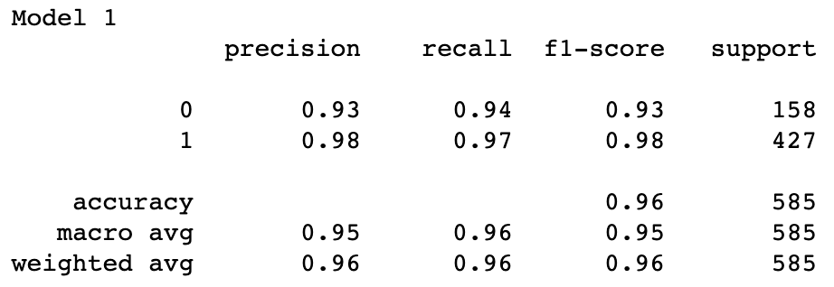

# Pneumonia Classification

### Using convolutional neural networks to identify pneumonia from chest x-rays

**Authors**: [Ijeoma Akamnonu](mailto:inakamno@buffalo.edu) ,[Alexandra Bruno](mailto:alexandrabruno7898@gmail.com)

## Overview 

We built a convolutional neural network to predict the prescence of pneumonia in chest x-rays of children. Due to our business problem, we prioritized recall and accuracy metrics. We were more tolerant towards false positives, but of course did not want to over predict on the pneumonia class, and for this reason we took accuracy metrics into consideration when evalutating our model.

## Business Problem

Those who exam x-rays in order to make a diagonsis are required to obtain years of training. Having a predcitive model that can determine whether an x-ray shows signs of pneumonia can be an extremely powerful too for understaffed health care facilities. This can be a helpful tool for the medical community to consider when resources need to better better allocated. 

## Data 

The data consists of 5,863 x-ray images. The data set shows both baterical and viral pneumonia 

Data split

1. Training set: 4101 images 
2. Validation set: 1170 images 
3. Testing set: 585 images

## Methodology 

Given the size of the original images we chose to resize them to 256x256x pixels and greyscale the images. 

For running the models we used an Adamn optimizer. The final model consists of 5 two-dimension convolutional layes and maxpooling layers, 2 dropout layers, and a flattening and densely connected layer. Recall and accuracy were the metrics we chose to optimize for this project. 

## Results

### Model 1 

### Model 2

### Final Model 

## Discusiion and Conclusion

The results of the model statisfied what we aimed to do initally, aim to have a high recall and accuracy score. Although the model isn't perfect, given that we had a week to complete the project we think this is a good start. Going forward we would like to implement other optimizers and try different hyperparameters to see if it is possible to improve the model further. 

